# Triends

👉 [Triends API Github]()  
👉 [Sehbeom's Triends Dev Log]()

## 주요 기능

- **유저 취향 조사**

  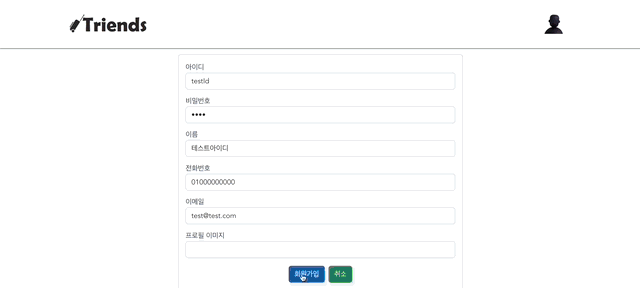

  → 유저 취향 조사 과정

  - 회원가입 과정에서 선호하는 여행지 유형을 선택할 수 있습니다.
  - 해당 정보는 유저 취향 기반 여행지 추천, 친구 추천에 활용됩니다.
  - 선택 가능한 여행지 유형은 다음과 같습니다.
    - 여행지 유형
      - 관광지 여행
      - 문화 여행
      - 축제•공연•행사 여행
      - 지역 투어 여행
      - 레포츠 여행
      - 호캉스 여행
      - 쇼핑 여행
      - 맛집 여행

- **여행지 추천**

  - 추천1 : 평점 기반 추천

    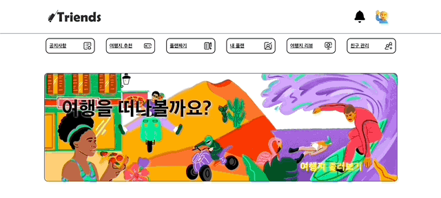

    → 홈 화면 하단 부분의 평점 기반 추천 여행지 목록

    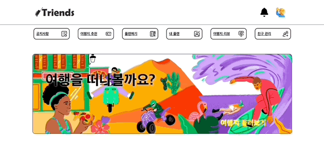

    → ‘여행지 추천’ 탭 상단 부분의 평점 기반 추천 여행지 목록

    - 평점 기반 추천은 홈 화면 아래 부분과 ‘여행지 추천’ 탭의 상단 부분에서 확인할 수 있습니다.
    - 해당 목록은 여행지의 평점 기준 내림차순으로 정렬됩니다.
    - 여행지의 평점은 리뷰 작성 과정에서 부여할 수 있습니다.

  - 추천2 : 유저 취향 기반 추천

    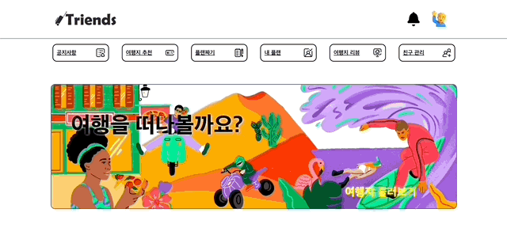

    → 유저 취향 기반 추천 여행지 목록

    - 유저 취향 기반 추천은 ‘여행지 추천’ 탭의 하단 부분에서 확인할 수 있습니다.
    - 추천 여행지 목록 생성 과정은 사용자 기반 협업 필터링 개념을 도입하였으며, 다음 과정으로 이루어집니다.
      - 유저 취향 기반 추천 여행지 목록 생성 과정
        - 현재 로그인한 유저와 타 유저 간의 취향 조사 결과를 비교하여 일치하는 비율(유사도)을 계산합니다.
        - 유사도 기준 상위 n명의 유저가 선택한 여행지 목록을 생성합니다.
        - 해당 여행지 목록을 평점 기준 내림차순하여 유저 취향 기반 추천 여행지 목록을 최종 생성합니다.

- **플랜 생성**

  - 유저는 ‘플랜짜기’ 탭을 통해 여행 플랜을 일자별로 생성할 수 있습니다.

  - 여행지 검색

    

    → 지도 내 여행지 검색

    - 우측 ‘검색결과’ 탭에서 지도 내 여행지를 검색할 수 있습니다.
    - 여행지 이름 또는 주소가 검색 키워드에 해당하는 여행지 정보를 지도와 우측 목록에서 확인할 수 있습니다.

  - 추천 여행지

    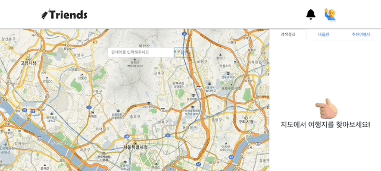

    → 지도 내 추천 여행지 검색

    - 우측 ‘추천여행지’ 탭을 통해 현재 표시된 지도 내에 위치한 여행지들 중 평점 기준 상위 n개의 여행지 목록을 확인할 수 있습니다.

  - 플랜 생성

    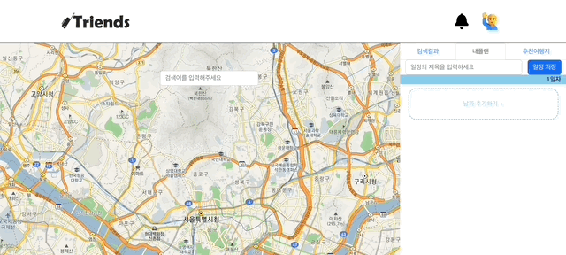

    → 플랜 일자별 여행지 추가

    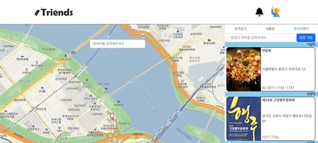

    → 플랜 제목 설정 및 플랜 생성

    - 우측 ‘내플랜’ 탭에서 일자를 증가시킬 수 있으며, 여행지를 해당 일자에 포함시킬 수 있습니다.
    - 여행지 추가가 완료되면 플랜 제목을 설정하고 ‘일정 저장’ 버튼을 통해 플랜을 저장할 수 있습니다.

- **리뷰 작성**

  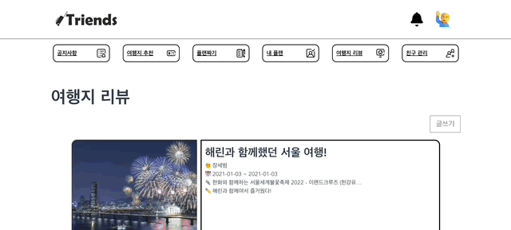

  → 리뷰 작성 시 여행지 별 평점 부여 가능

  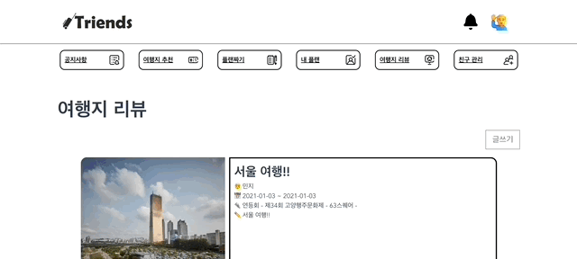

  → 리뷰 조회 시 일자별 여행지와 평점 확인 가능

  - 생성한 플랜에 대해 리뷰를 작성할 수 있으며, 리뷰 작성 시 각 여행지에 평점을 적용할 수 있습니다.
  - 리뷰 조회 페이지에서 일자별 여행지를 확인할 수 있으며, 작성자가 각 여행지에 부여한 평점을 확인할 수 있습니다.

- **친구 목록 조회 및 친구 추천**

  - 친구 목록 조회

    

    → 친구 목록 조회

    - ‘친구 관리’ 탭에서 친구 목록을 확인할 수 있습니다.

  - 친구 추천1 : 친구 관계 기반

    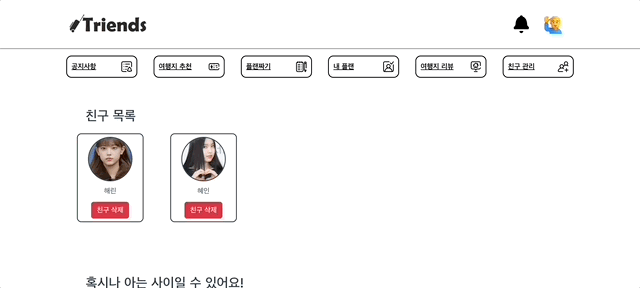

    → 친구 관계 기반 친구 추천

    - 유저 간의 친구 관계를 기반으로 친구를 추천받을 수 있습니다.
    - 친구 관계 기반 친구 추천 목록은 다음과 같은 과정으로 생성됩니다.
      - 친구 관계 기반 친구 추천 목록 생성 과정
        - 현재 로그인한 유저의 친구 목록을 생성합니다.
        - 해당 목록 내 유저들의 친구 목록을 조회하며 겹치는 유저에 대해 겹치는 횟수를 계산합니다.
        - 겹치는 횟수 기준 상위 n명의 유저로 친구 추천 목록을 생성합니다.

  - 친구 추천2 : 유저 취향 기반

    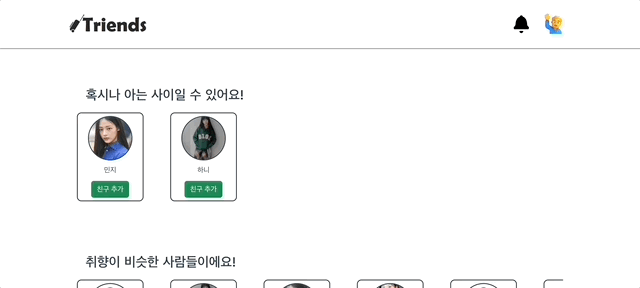

    → 유저 취향 기반 친구 추천

    - 현재 로그인한 유저의 취향 조사 결과와 유사한 유저들을 친구로 추천받을 수 있습니다.
    - 유저 취향 기반 친구 추천 목록은 다음과 같은 과정으로 생성됩니다.
      - 유저 취향 기반 친구 추천 목록 생성 과정
        - 현재 로그인한 유저와 타 유저 간의 취향 조사 결과를 비교하여 일치하는 비율(유사도)을 계산합니다.
        - 유사도 기준 상위 n명의 유저로 친구 추천 목록을 생성합니다.

  - 친구 검색

    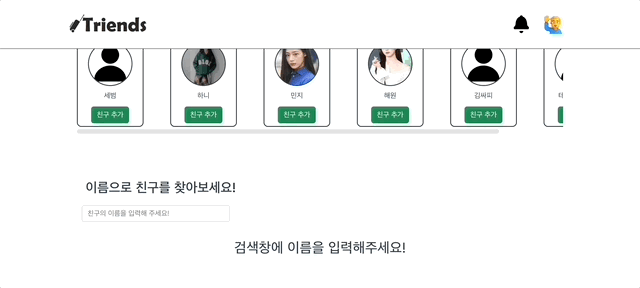

    → 친구 검색

    - 이름으로 유저를 검색할 수 있습니다.

- **알림 (플랜 초대 및 친구 추가)**

  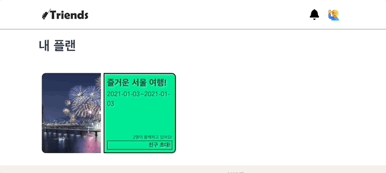

  → 플랜 초대

  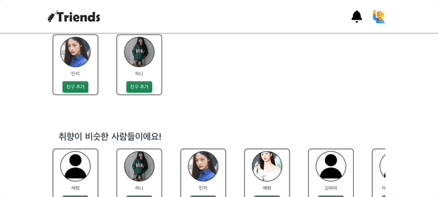

  → 친구 추가

  - 알림은 다음 두가지 경우에 대해 전달됩니다.
    - 플랜 초대
    - 친구 추가

  

  → 알림 확인 및 수락, 거절

  - 수신한 알림 목록은 상단 헤더의 종모양 아이콘을 통해 확인할 수 있으며, 수신한 알림이 있을 경우 애니메이션 효과와 빨간점이 추가됩니다.
  - 각 알림은 수락, 거절 중 선택할 수 있습니다.
